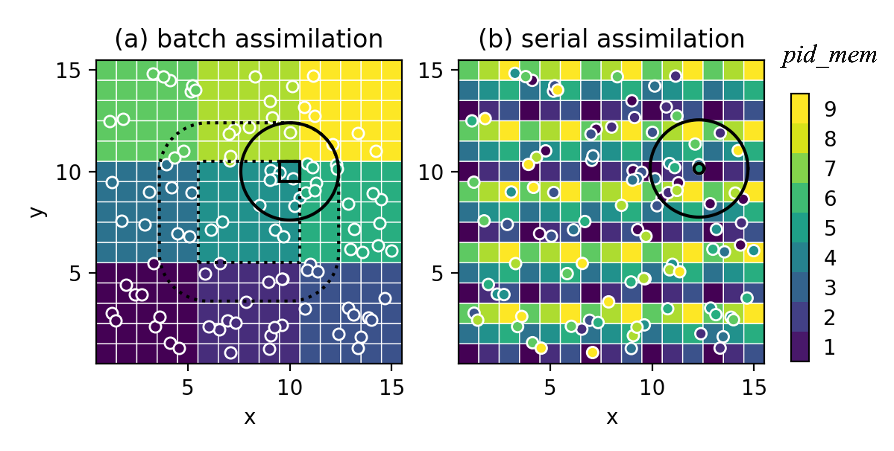

Offline filtering analysis scheme
=================================

Parallelization strategy
------------------------
A compromise is made in favor of code flexibility than its runtime efficiency. We aim for more modular design so that components in the DA algorithm can be easily changed/upgraded/compared. A pause-restart strategy is used: the model writes the state to restart files, then DA reads those files and computes the analysis and outputs to the updated files, and the model continues running. This is "offline" assimilation. In operational systems, sometimes we need "online" algorithms where everything is hold in the memory to avoid slow file I/O.  NEDAS provides parallel file I/O, not suitable for time-critical applications, but efficient enough for most research and development purposes.

The first challenge on dimensionality demands a careful design of memory layout among processors. The ensemble model state has dimensions: `member`, `variable`, `time`, `z`, `y`, `x`. When preparing the state, it is easier for a processor to obtain all the state variables for one member, since they are typically stored in the same model restart file. Each processor can hold a subset of the ensemble states, this memory layout is called "state-complete". To apply the ensemble DA algorithms, we need to transpose the memory layout to "ensemble-complete", where each processor holds the entire ensemble but only for part of the state variables (`Anderson & Collins 2007 <https://doi.org/10.1175/JTECH2049.1>`_).

In NEDAS, for each member the model state is further divided into "fields" with dimensions (`y`, `x`) and "records" with dimensions (`variable`, `time`, `z`). Because, as the model dimension grows, even the entire state for one member maybe too big for one processor to hold in its memory. The smallest unit is now the 2D field, and each processor holds only a subset along the record dimension. Accordingly, the processors (`pid`) are divided into "member groups" (with same `pid_rec`) and "record groups" (with same `pid_mem`), see Fig. 1 for example. "State-complete" now becomes "field-complete". The record dimension allows parallel processing of different fields by the `read_var` functions in model modules. And during assimilation, each `pid_rec` only solves the analysis for its own list of `rec_id`.


figure ../imgs/transpose.png

Transpose from field-complete to ensemble-complete, illustrated by a 18-processor memory layout (`pid` = 1, ..., 18), divided into 2 groups (`pid_rec` = 0, 1), each with 9 processors (`pid_mem` = 0, 1, 2). The data has dimensions `mem_id` = 1:100 members, `par_id` = 1:9 partitions, and `rec_id` = 1:4 records. The gray arrows show sending/receiving of data to perform the transpose. The yellow arrows is an additional collection step (only needed by observation data)

For observations, it is easier to process the entire observing network at once, instead of going through the measurements one by one. Therefore, each observing network (record) is assigned a unique `obs_rec_id` to be handled by one processor.
Each `pid_rec` only needs to process its own list of `obs_rec_id`. Processors with `pid_mem` = 0 is responsible for reading and processing the actual observations using `read_obs` functions from dataset modules, while all `pid_mem` separately process their own members for the observation priors.
When transposing from field-complete to ensemble-complete is done, an additional collection step among different `pid_rec` is required, which gathers all `obs_rec_id` for each `rec_id` to form the final local observation.

When the transpose is complete, on each `pid`, the local ensemble state\_prior[`mem_id`, `rec_id`][`par_id`] is updated to the posterior state\_post, using local observations lobs[`obs_rec_id`][`par_id`] and observation priors lobs\_prior[`mem_id`, `obs_rec_id`][`par_id`].



Memory layout for state variables (square pixels) and observations (circles) using (a) batch and (b) serial assimilation strategies. The colors represent the processor id `pid_mem` that stores the data.


NEDAS offline filter scheme provides two assimilation modes:

In batch mode, the analysis domain is divided into small local partitions (indexed by `par_id`) and each `pid_mem` solves the analysis for its own list of `par_id`. The local observations are those falling inside the localization radius for each [`par_id`,`rec_id`]. The "local analysis" for each state variable is computed using the matrix-version ensemble filtering equations (such as [LETKF](https://doi.org/10.1016/j.physd.2006.11.008), [DEnKF](https://doi.org/10.1111/j.1600-0870.2007.00299.x)). The batch mode is favorable when the local observation volume is small and the matrix solution allows more flexible error covariance modeling (e.g., to include correlations in observation errors).

In serial mode, we go through the observation sequence and assimilation one observation at a time. Each `pid` stores a subset of state variables and observations with `par_id`, here locality doesn't matter in storage, the `pid` owning the observation being assimilated will first compute observation-space increments, then broadcast them to all the `pid` with state\_prior and/or lobs\_prior within the observation's localization radius and they will be updated. For the next observation, the updated observation priors will be used for computing increments. The whole process iteratively updates the state variables on each `pid`. The serial mode is more scalable especially for inhomogeneous network where load balancing is difficult, or when local observation volume is large. The scalar update equations allow more flexible use of nonlinear filtering approaches (such as particle filter, rank regression).

NEDAS allows flexible modifications in the interface between model/dataset modules and the core assimilation algorithms, to achieve more sophisticated functionality:

Multiple time steps can be added in the `time` dimension for the state and/or observations to achieve ensemble smoothing instead of filtering. Iterative smoothers can also be formulated by running the analysis cycle as an outer-loop iteration (although they can be very costly).

Miscellaneous transform functions can be added for state and/or observations, for example, Gaussian anamorphosis to deal with non-Gaussian variables; spatial bandpass filtering to run assimilation for "scale components" in multiscale DA; neural networks to provide a nonlinear mapping between the state space and observation space, etc.


Description of Key Variables and Functions

```{figure} ../imgs/workflow.png
:width: 100%
:align: center
```
<!--| **Figure 3**. Workflow for one assimilation cycle/iteration. For the sake of clarity, only the key variables and functions are shown. Black arrows show the flow of information through functions.| -->

Indices and lists:

* For each processor, its `pid` is the rank in the communicator `comm` with size `nproc`. The `comm` is split into `comm_mem` and `comm_rec`. Processors in `comm_mem` belongs to the same record group, with `pid_mem` in `[0:nproc_mem]`. Processors in `comm_rec` belongs to the same member group, with `pid_rec` in `[0:nproc_rec]`. Note that `nproc = nproc_mem * nproc_rec`, user should set `nproc` and `nproc_mem` in the config file.

* `mem_list`[`pid_mem`] is a list of members `mem_id` for processors with `pid_mem` to handle.

* `rec_list`[`pid_rec`] is a list of field records `rec_id` for processors with `pid_rec` to handle.

* `obs_rec_list`[`pid_rec`] is a list of observation records `obs_rec_id` for processors with `pid_rec` to handle.

* `partitions` is a list of tuples `(istart, iend, di, jstart, jend, dj)` defining the partitions of the 2D analysis domain, each partition holds a slice `[istart:iend:di, jstart:jend:dj]` of the field and is indexed by `par_id`.

* `par_list`[`pid_mem`] is a list of partition id `par_id` for processor with `pid_mem` to handle.

* `obs_inds`[`obs_rec_id`][`par_id`] is the indices in the entire observation record `obs_rec_id` that belong to the local observation sequence for partition `par_id`.


Data structures:

* `fields_prior`[`mem_id`, `rec_id`] points to the 2D fields `fld[...]` (np.array).

* `z_fields`[`mem_id`, `rec_id`] points to the z coordinate fields `z[...]` (np.array).

* `state_prior`[`mem_id`, `rec_id`][`par_id`] points to the field chunk `fld_chk` (np.array) in the partition.

* `obs_seq`[`obs_rec_id`] points to observation sequence `seq` that is a dictionary with keys ('obs', 't', 'z', 'y', 'x', 'err\_std') each pointing to a list containing the entire record.

* `lobs`[`obs_rec_id`][`par_id`] points to local observation sequence `lobs_seq` that is a dictionary with same keys as `seq` but the lists only contain a subset of the record.

* `obs_prior_seq`[`mem_id`, `obs_rec_id`] points to the observation prior sequence (np.array), same length with `seq['obs']`.

* `lobs_prior`[`mem_id`, `obs_rec_id`][`par_id`] points to the local observation prior sequence (np.array), same length with `lobs_seq`.


Functions:

* `prepare_state()`: For member `mem_id` in `mem_list` and field record `rec_id` in `rec_list`, load the model module and `read_var()` gets the variables in model native grid, convert to analysis grid, and apply miscellaneous user-defined transforms. Also, get z coordinates in the same prodcedure using `z_coords()` functions. Returns `fields_prior` and `z_fields`.

* `prepare_obs()`: For observation record `obs_rec_id` in `obs_rec_list`, load the dataset module and `read_obs()` get the observation sequence. Apply miscellaneous user-defined transforms if necessary. Returns `obs_seq`.

* `assign_obs()`: According to ('y', 'x') coordinates for `par_id` and ('variable', 'time', 'z') for `rec_id`, sort the full observation sequence `obs_rec_id` to find the indices that belongs to the local observation subset. Returns `obs_inds`.

* `prepare_obs_from_state()`: For member `mem_id` in `mem_list` and observation record `obs_rec_id` in `obs_rec_list`, compute the observation priors from model state. There are three ways to get the observation priors: 1) if the observed variable is one of the state variables, just get the variable with `read_field()`, or 2) if the observed variable can be provided by model module, then get it through `read_var()` and convert to analysis grid. These two options obtains observed variables defined on the analysis grid, then we convert them to the observing network and interpolate to the observed z location. Option 3) if the observation is a complex function of the state, the user can provide `obs_operator()` in the dataset module to compute the observation priors. Finally, the same miscellaneous user-defined transforms can be applied. Returns `obs_prior_seq`.

* `transpose_field_to_state()`: Transposes field-complete `field_prior` to ensemble-complete `state_prior` (illustrated in Fig.1). After assimilation, the reverse `transpose_state_to_field()` transposes `state_post` back to field-complete `fields_post`.

* `transpose_obs_to_lobs()`: Transpose the `obs_seq` and `obs_prior_seq` to their ensemble-complete counterparts `lobs` and `lobs_prior` (illustrated in Fig. 2).

* `batch_assim()`: Loop through the local state variables in `state_prior`, for each state variable, the local observation sequence is sorted based on the localization and impact factors. If the local observation sequence is not empty, compute the `local_analysis()` to update state variables, save to `state_post` and return.

* `serial_assim()`: Loop through the observation sequence, for each observation, the processor storing this observation will compute `obs_increment()` and broadcast. For all processors, if some of its local state/observations are within the localization radius of this observation, compute `update_local_ens()` to update these state/observations. Do this iteratively for all observations until end of sequence. Returns the updated local `state_post`.

* `update()`: Take `state_prior` and `state_post`, apply miscellaneous user-defined inverse transforms, compute `analysis_incr()`, convert the increment back to model native grid and add the increments to the model variables int he restart files. Apart from simply adding the increments, some other post-processing steps can be implemented, for example using the increments to compute optical flows and align the model variables instead.


NEDAS.schemes.offline\_filter module
------------------------------------

.. automodule:: NEDAS.schemes.offline_filter
   :members:
   :show-inheritance:
   :undoc-members:
