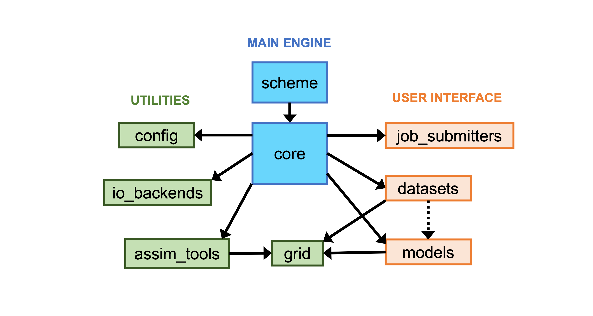

Software Architecture
=====================

   Overview of the NEDAS software architecture.  Boxes in blue are the main engine that orchestrates the assimilation
   workflow, providing base classes in ``NEDAS.core``. Boxes in orange are user-provided implementations for interfacing with specific models and
   datasets and running on specific computers. Boxes in green are utility functions and algorithm implementations in ``NEDAS.assim_tools``.

Design Philosophy
-----------------

NEDAS separates the DA workflow into three concerns:

* **Orchestration** — *when* and *how* each step runs (handled by ``Scheme`` and ``Context``).
* **Algorithm** — *what computation* transforms the prior ensemble into a posterior
  (handled by ``Assimilator``, ``Updator``, ``Inflation``, ``Transform``).
* **Interface** — *how* model state and observations are read and written, and jobs are run
  (handled by ``Model``, ``Dataset``, ``JobSubmitter``).

Each concern is encapsulated behind an abstract base class (ABC).  Concrete implementations are
discovered and instantiated at runtime via factory functions, so adding support for a new model,
observation type, or DA algorithm requires only a new subclass — the orchestration layer does not
change.

Package Map
-----------

.. code-block:: text

   NEDAS/
   ├── config/          # Config class; YAML parsing and validation
   ├── core/            # Abstract base classes (the framework)
   │   ├── context.py   # Context  — runtime state manager
   │   ├── scheme.py    # Scheme   — workflow orchestrator (ABC)
   │   ├── state.py     # State    — ensemble state (field/ensemble-complete layouts, transposes)
   │   ├── obs.py       # Obs      — observations (obs sequence, priors, transposes)
   │   ├── model.py     # Model    — forecast model interface (ABC)
   │   ├── dataset.py   # Dataset  — observation dataset interface (ABC)
   │   ├── assimilator.py  # Assimilator — DA algorithm (ABC)
   │   ├── updator.py      # Updator     — restart-file update (ABC)
   │   ├── inflation.py    # Inflation   — ensemble inflation (ABC)
   │   ├── transform.py    # Transform   — state/obs transforms (ABC)
   │   ├── io_backend.py   # IOBackend   — file vs. memory I/O (ABC)
   │   ├── job_submitter.py # JobSubmitter — HPC dispatch (ABC)
   │   └── types.py        # Type aliases and dataclasses (FieldRecord, ObsRecord, …)
   ├── schemes/         # Concrete Scheme implementations
   │   ├── filter.py    # FilterAnalysisScheme — cycling filter analysis
   │   └── forecast.py  # ForecastScheme       — ensemble forecast only
   ├── assim_tools/     # Concrete algorithm implementations
   │   ├── assimilators/   # ETKF, TopazDEnKF (batch); EAKF (serial)
   │   ├── updators/       # AdditiveUpdator, AlignmentUpdator
   │   ├── inflation/      # MultiplicativeInflation, RTPP
   │   ├── localization/   # distance_based, correlation_based
   │   ├── covariance/     # ensemble, static
   │   └── transforms/     # identity, scale_bandpass
   ├── models/          # Forecast model implementations
   │   ├── vort2d/      # 2D vorticity (Python, for tutorials)
   │   ├── lorenz96/    # Lorenz 1996 (Python, for tutorials)
   │   ├── qg/          # Quasi-geostrophic (Fortran, emulator, and naitive Python)
   │   ├── nextsim/     # neXtSIM sea-ice model (v1 and DG)
   │   ├── topaz/       # TOPAZ coupled ocean–ice (v4 and v5)
   │   └── wrf/         # WRF atmosphere
   ├── datasets/        # Observation dataset implementations
   │   ├── synthetic/   # Synthetic (OSSE) observations
   │   ├── vort2d/      # Observations for the vort2d model
   │   ├── osisaf/      # OSISAF sea-ice concentration and drift
   │   ├── amsr2/       # AMSR-2 passive microwave
   │   ├── cs2smos/     # CryoSat-2 / SMOS sea-ice thickness
   │   ├── ifremer/     # Argo float profiles
   │   └── rgps/        # RGPS sea-ice deformation
   ├── grid/            # Grid classes (regular, irregular, 1-D)
   ├── io_backends/     # OfflineIOBackend, OnlineIOBackend
   ├── job_submitters/  # local, macOS, SLURM, OAR, Betzy, GRICAD
   ├── diag/            # Diagnostics and plotting utilities
   └── utils/           # parallel (MPI), conversion, FFT, netCDF helpers

Core Abstractions
-----------------

``Context``
~~~~~~~~~~~

``Context`` is the single runtime object that all other components share.
It is created once by ``Scheme.__init__()`` and passed as the first argument ``c`` to every
method in the framework.  It holds:

* MPI communicators ``comm``, ``comm_mem``, ``comm_rec`` and the derived indices ``pid``,
  ``pid_mem``, ``pid_rec``.
* The analysis grid (``c.grid``), ensemble size (``c.nens``), current time (``c.time``), and
  iteration counter (``c.iter``).
* References to all active ``Model`` and ``Dataset`` instances
  (``c.models``, ``c.datasets``).
* The algorithm components created at the start of each outer-loop iteration:
  ``c.assimilator``, ``c.updator``, ``c.localization_funcs``, ``c.inflation_func``,
  ``c.transform_funcs``.
* The ``State`` (``c.state``) and ``Obs`` (``c.obs``) objects that hold ensemble data in memory.

``Scheme``
~~~~~~~~~~

``Scheme`` is the top-level workflow orchestrator.  Its ``__call__()`` entry point checks the
runtime environment and either runs ``run_all()`` directly (serial or already-inside-MPI) or
re-dispatches itself into an MPI-enabled subprocess via ``external_call()``.

``run_all()`` is implemented by each concrete subclass and calls ``run_step()`` for each
named step.  ``run_step()`` decides whether to execute locally or to spawn an MPI subprocess,
according to ``steps_need_mpi``.

Currently available schemes:

* ``FilterAnalysisScheme`` — cycling DA experiment.  Steps: ``prepare_truth``,
  ``prepare_init_ensemble``, ``preprocess``, ``perturb``, ``filter``, ``postprocess``,
  ``ensemble_forecast``, ``diagnose``.  The ``filter`` step runs one or more outer-loop
  iterations of ``filter_iter()``, each invoking ``State.prepare_state`` → ``Obs.prepare_obs``
  → ``Obs.prepare_obs_from_state`` → ``Assimilator.assimilate`` → ``Updator.update``.
* ``ForecastScheme`` — ensemble forecast without assimilation.

``Model`` and ``Dataset``
~~~~~~~~~~~~~~~~~~~~~~~~~

``Model`` and ``Dataset`` are the user-extension points.  Each concrete subclass is placed in its
own directory under ``NEDAS/models/`` or ``NEDAS/datasets/``.  The directory must contain a
``default.yml`` with default configuration values; the class reads them via ``parse_config()``.

Key methods that a ``Model`` subclass must implement:

* ``read_grid(**kwargs)`` — read the model grid from files and populate ``self.grid``.
* ``read_var(**kwargs) → np.ndarray`` — return a 2D (or 3D) field for a given variable, time,
  member, and vertical level.  In offline mode this reads from restart files; in online mode it
  reads from ``self.memory``.
* ``z_coords(**kwargs) → np.ndarray`` — return the vertical coordinate field at a given level.
* ``run(**kwargs)`` — advance the model forward by one forecast period.
* Optionally: ``preprocess``, ``postprocess``, ``generate_truth``, ``generate_init_ensemble``.

Key members that a ``Dataset`` subclass must implement:

* ``variables: dict[VarName, VarDesc]`` — the set of observable quantities this dataset provides.
* ``read_obs(**kwargs) → dict[str, np.ndarray]`` — return an observation sequence dict with
  keys ``'obs'``, ``'x'``, ``'y'``, ``'z'``, ``'t'``, ``'err_std'``.
* Optionally: ``obs_operator: dict[VarName, Callable]`` — nonlinear observation operators for
  variables that cannot be obtained directly from ``model.read_var()``.

``Assimilator`` and ``Updator``
~~~~~~~~~~~~~~~~~~~~~~~~~~~~~~~~

``Assimilator`` defines the three abstract methods that a DA algorithm must implement:

* ``init_partitions(c)`` — partition the analysis domain.
* ``assign_obs(c)`` — map each observation to its relevant partitions.
* ``assimilation_algorithm(c)`` — update ``state_prior`` → ``state_post`` using ``lobs`` and
  ``lobs_prior``.

``assimilate(c)`` is the non-abstract driver that calls ``partition_grid()``, the two transpose
steps, ``assimilation_algorithm()``, the reverse transpose, and the posterior output.

``Updator`` maps the posterior back to the model restart files:

* ``compute_increment(c)`` — compute the difference ``fields_post - fields_prior``.
* ``update_files(c, mem_id, rec_id)`` — apply the increment to the model restart file for the
  given member and field record.

Available algorithm implementations:

.. list-table::
   :header-rows: 1
   :widths: 20 20 60

   * - Class
     - Mode
     - Description
   * - ``ETKF``
     - batch
     - Ensemble Transform Kalman Filter
   * - ``TopazDEnKF``
     - batch
     - Deterministic EnKF used in the TOPAZ system
   * - ``EAKF``
     - serial
     - Ensemble Adjustment Kalman Filter (DART-style)
   * - ``AdditiveUpdator``
     - —
     - Adds analysis increment directly to restart fields
   * - ``AlignmentUpdator``
     - —
     - Derives optical-flow displacement from the increment and applies it

``IOBackend`` and ``JobSubmitter``
~~~~~~~~~~~~~~~~~~~~~~~~~~~~~~~~~~~

``IOBackend`` abstracts the data pathway:

* **Offline** (``OfflineIOBackend``) — state and observations are exchanged through binary files
  on disk.  This is the default and supports arbitrary parallel file systems.
* **Online** (``OnlineIOBackend``) — state is held in Python dictionaries in memory
  (``model.memory``), avoiding file I/O entirely.  Suitable for lightweight models such as
  ``vort2d`` and ``lorenz96``.

``JobSubmitter`` abstracts job dispatch:

* ``local`` / ``macos`` — runs tasks as local subprocesses.
* ``slurm`` / ``oar`` / ``betzy`` / ``gricad`` — submits tasks to HPC batch schedulers.

The scheme selects the appropriate backend via ``io_mode`` and ``job_submit`` in the
configuration file; the rest of the code is unaware of which backend is active.

Runtime Flow (Filter Scheme)
-----------------------------

The sequence below describes one outer-loop iteration of ``FilterAnalysisScheme.filter_iter()``:

1. ``Context.update_assim_tools()`` — (re-)instantiates ``Assimilator``, ``Updator``,
   ``Inflation``, and ``Transform`` objects for this iteration.  For multiscale DA the analysis
   grid resolution is also updated here.
2. ``State.prepare_state(c)`` — each processor reads its subset of ``(mem_id, rec_id)`` fields
   from the model restart files via ``model.read_var()``, converts them to the analysis grid,
   applies transforms, and populates ``fields_prior`` and ``fields_z``.
3. ``Obs.prepare_obs(c)`` — the root of each record group reads the observation sequence via
   ``dataset.read_obs()`` and broadcasts to its group, populating ``obs_seq``.
4. ``Obs.prepare_obs_from_state(c, 'prior')`` — each processor computes observation priors from
   its subset of members, populating ``obs_prior``.
5. ``Assimilator.assimilate(c)``:

   a. Prior inflation (``Inflation``).
   b. ``partition_grid()`` — partition the domain, assign observations to partitions.
   c. Transpose ``fields_prior`` / ``fields_z`` / ``obs_seq`` / ``obs_prior`` to
      ensemble-complete layout (``state_prior`` / ``state_z`` / ``lobs`` / ``lobs_prior``).
   d. ``assimilation_algorithm()`` — compute ``state_post`` (and ``lobs_post`` in serial mode).
   e. Transpose ``state_post`` back to field-complete ``fields_post``.
   f. Posterior inflation (``Inflation``).

6. ``Updator.update(c)`` — compute increments from ``fields_prior`` / ``fields_post`` and write
   them back to the model restart files.
