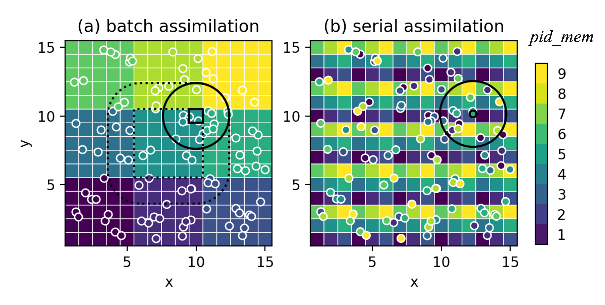
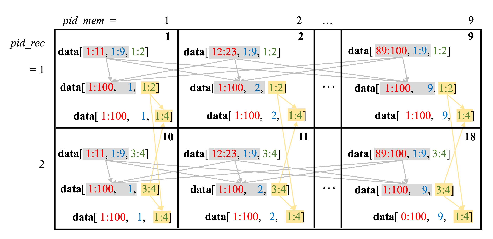
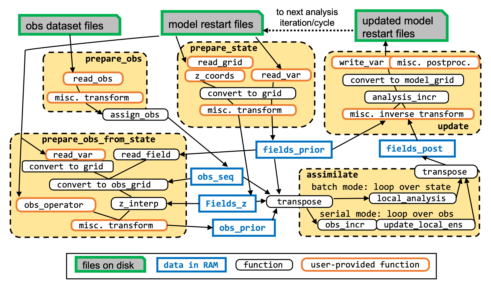

Offline Filter Scheme
=====================

Overview
--------

DA seeks to optimally combine information from model forecasts and observations to obtain the best
estimate of the state or parameters of a dynamical system — the *analysis*.
The challenges for modern geophysical models are: (1) the large-dimensional model state and
observations, and (2) the nonlinearity in model dynamics and in the state–observation relation.

NEDAS addresses the first challenge through distributed-memory parallel computation, since the
full ensemble state may be too large to fit in the RAM of a single processor.
A *pause-restart* strategy is used: the forecast model writes its state to restart files,
the assimilation step reads those files, computes the analysis, writes the updated files, and
the model continues.  This is *offline* assimilation, as opposed to *online* algorithms where
model and DA share memory.  NEDAS provides parallel file I/O that is efficient enough for most
research and development purposes, though it is not aimed at latency-critical operational use.

Parallel Memory Layout
----------------------

The ensemble model state has dimensions: ``member``, ``variable``, ``time``, ``z``, ``y``, ``x``,
indexed by ``mem_id``, ``v``, ``t``, ``k``, ``j``, ``i`` with sizes ``nens``, ``nv``, ``nt``,
``nz``, ``ny``, ``nx``.

To parallelize workload, the dimensions are grouped into three indices:

* ``mem_id`` — indexes the ensemble members.
* ``rec_id`` (``FieldRecordID``) — indexes unique 2D fields identified by the tuple ``(v, t, k)``.
  Because ``nz`` and ``nt`` may vary between variables, these dimensions are stacked into a flat
  *record* dimension of size ``nrec``.
* ``par_id`` (``PartitionID``) — indexes spatial partitions, which are subsets of the 2D analysis
  grid.  For a regular grid each partition is defined by a slice tuple ``(istart, iend, di, jstart,
  jend, dj)``; for an irregular grid it is an array of grid-point indices.

At any moment each processor stores a subset of the state in one of two layouts:

* **Field-complete** — the processor holds all ``par_id`` but only a subset of ``(mem_id, rec_id)``.
  This layout is natural for file I/O and pre/post-processing.
* **Ensemble-complete** — the processor holds all ``mem_id`` but only a subset of ``(rec_id,
  par_id)``.  This layout is required by ensemble DA algorithms.

The ``nproc`` processors are organised along two dimensions:

* ``pid_mem`` ∈ ``[0, nproc_mem)`` — index within ``comm_mem``.  Processors sharing the same
  ``pid_rec`` belong to the same ``comm_mem`` group (a *record group*); they each hold a different
  subset of members for the same set of records.
  Computed as ``pid_mem = pid % nproc_mem``.
* ``pid_rec`` ∈ ``[0, nproc_rec)`` — index within ``comm_rec``.  Processors sharing the same
  ``pid_mem`` belong to the same ``comm_rec`` group (a *member group*); they each hold a different
  subset of records for the same set of members.
  Computed as ``pid_rec = pid // nproc_mem``.
* ``nproc = nproc_mem × nproc_rec``; set both in the configuration file.

   Memory layout for 6 processors (``pid`` = 0, …, 5), divided into 2 member groups
   (``pid_rec`` = 0, 1) and 3 record groups (``pid_mem`` = 0, 1, 2).
   The state has dimensions: 100 members (``mem_id``), 16 partitions (``par_id``), and 50 records
   (``rec_id``).  The field-complete **fields** hold all partitions but only a subset of the
   ensemble; after the transpose (gray arrows) the ensemble-complete **state** holds all members
   but only a subset of partitions.

Transpose Operations
--------------------

Two transposes are required before assimilation can begin.

   Schematic of the state and observation transpose operations.
   Gray arrows: state transpose (field-complete ``fields_prior`` → ensemble-complete
   ``state_prior``).  Yellow arrows: the additional ``comm_rec`` allgather that collects all
   observation records needed by each processor for the local observation ensembles.

**State transpose.**
``State.transpose_to_ensemble_complete(c, fields_prior)`` communicates within ``comm_mem``
to move the field-complete ``fields_prior`` (``FieldEns``) into the ensemble-complete
``state_prior`` (``StateEns``).  The same transpose is applied to ``fields_z`` to produce
``state_z``.  After assimilation, the reverse ``State.transpose_to_field_complete(c, state_post)``
brings the ensemble-complete ``state_post`` back to field-complete ``fields_post`` so that
``Updator.update(c)`` can write increments to the model restart files.

**Observation transpose.**
Within each ``comm_mem`` record group, only the processor with ``pid_mem == 0`` reads and
processes the actual observations via ``collect_obs_seq()``; the result is then broadcast to all
other ``pid_mem`` in the same group.  All ``pid_mem`` independently compute observation priors
for their own members.

The transpose proceeds in two steps (performed separately for the observation sequence and the
observation prior ensemble):

1. *Within* ``comm_mem``: send the field-complete observations/priors from the source processor to
   the destination processors so that each processor holds the full ensemble for its own subset of
   partitions ``par_list[pid_mem]``.
2. *Across* ``comm_rec``: ``allgather`` all ``obs_rec_id`` within ``comm_rec`` so that each
   ``pid_rec`` has the complete set of observation records needed to update its own ``rec_list``.

Concretely, ``Obs.transpose_obs_seq(c, obs_seq)`` converts ``obs_seq`` (``ObsSeq``) to ``lobs``
(``LocalObsSeq``), and ``Obs.transpose_to_ensemble_complete(c, obs_prior)`` converts ``obs_prior``
(``ObsEns``) to ``lobs_prior`` (``LocalObsEns``).  Both are called by
``Assimilator.transpose_to_ensemble_complete(c)``.

Assimilation Modes
------------------

Once the transposes are complete, each processor holds the local ensemble
``state_prior[mem_id, rec_id][par_id]`` (``np.ndarray``),
``lobs[obs_rec_id][par_id]`` (``dict[str, np.ndarray]``), and
``lobs_prior[mem_id, obs_rec_id][par_id]`` (``np.ndarray``).
Before calling the assimilation algorithm, both state and observation data are packed into flat
arrays via ``State.pack_local_state_data(c, par_id, ...)`` and
``Obs.pack_local_obs_data(c, par_id, ...)``.

**Batch mode** (``BatchAssimilator``).**
The analysis domain is divided into square tiles (``par_id``), with ``~3 × nproc_mem`` tiles to
allow load-balanced distribution.  ``BatchAssimilator.assimilation_algorithm(c)`` loops over
``par_list[pid_mem]``; for each tile it loops over unmasked grid points and calls
``local_analysis(c, loc_id, ind, hlfactor, state_data, obs_data)`` with the subset of
observations within the horizontal localisation radius ``hroi``.  Implemented algorithms include
matrix-form ensemble filters such as
`LETKF <https://doi.org/10.1016/j.physd.2006.11.008>`_ and
`DEnKF <https://doi.org/10.1111/j.1600-0870.2007.00299.x>`_.
Batch mode is favourable when the local observation volume is small or when the matrix formulation
enables more flexible error-covariance modelling.

**Serial mode** (``SerialAssimilator``).**
Partitions tile the domain so that each ``pid_mem`` owns one non-overlapping subset spanning the
full domain.  ``SerialAssimilator.assimilation_algorithm(c)`` iterates over a global ordered list
of individual observations.  For each observation the owning processor computes
``obs_increment(obs_prior, obs, obs_err_std)`` and broadcasts it; all processors then call
``update_local_state(...)`` and ``update_local_obs(...)`` to update the state and observation
priors within the localisation radius.  Updated observation priors are reused for subsequent
observations, making the update iterative.  Serial mode scales better for inhomogeneous networks
or large local observation volumes, and scalar updates enable nonlinear filtering approaches such
as particle filters or rank regression.

Assimilation Workflow
---------------------

   Workflow for one assimilation cycle/iteration.  Key variables and functions are shown; black
   arrows indicate the flow of information.  User-provided functions (``read_var``, ``z_coords``,
   ``read_obs``, ``obs_operator``) are the interface between model/dataset modules and the core DA
   algorithms.

Key Variables
-------------

Indices and communicators
~~~~~~~~~~~~~~~~~~~~~~~~~

* ``pid`` — rank in the global communicator ``comm`` of size ``nproc``.
* ``pid_mem`` — rank within ``comm_mem`` (record group); ``pid_mem = pid % nproc_mem``.
* ``pid_rec`` — rank within ``comm_rec`` (member group); ``pid_rec = pid // nproc_mem``.
* ``comm_mem`` — sub-communicator grouping all processors with the same ``pid_rec``.
* ``comm_rec`` — sub-communicator grouping all processors with the same ``pid_mem``.
* ``mem_list: dict[ProcIDMem, list[MemID]]`` — maps each ``pid_mem`` to its list of member indices ``mem_id``.
* ``rec_list: dict[ProcIDRec, list[FieldRecordID]]`` — maps each ``pid_rec`` to its list of field record indices ``rec_id``.
* ``obs_rec_list: dict[ProcIDRec, list[ObsRecordID]]`` — maps each ``pid_rec`` to its list of observation record indices ``obs_rec_id``.
* ``partitions: list`` — spatial partitions of the analysis domain.  Each entry is either a slice tuple ``(istart, iend, di, jstart, jend, dj)`` (regular 2D grid) or an index array (irregular grid).
* ``par_list: dict[ProcIDMem, list[PartitionID]]`` — maps each ``pid_mem`` to its list of partition indices ``par_id``.
* ``obs_inds: dict[ObsRecordID, dict[PartitionID, np.ndarray]]`` — for each ``obs_rec_id`` and ``par_id``, the integer indices into the full observation record that belong to the local observation subset for that partition.

Data structures
~~~~~~~~~~~~~~~

* ``fields_prior: FieldEns`` — ``dict[(MemID, FieldRecordID), np.ndarray]``.  Field-complete prior state; each value is a 2D field ``fld[j, i]`` (or ``fld[2, j, i]`` for vector fields).
* ``fields_z: FieldEns`` — same structure as ``fields_prior``; holds z-coordinate fields for each record.
* ``state_prior: StateEns`` — ``dict[(MemID, FieldRecordID), dict[PartitionID, np.ndarray]]``.  Ensemble-complete prior state; ``state_prior[mem_id, rec_id][par_id]`` is the 1-D array of unmasked field values in the partition.
* ``state_z: StateEns`` — same structure as ``state_prior``; holds z-coordinate values in ensemble-complete layout.
* ``state_post: StateEns`` — same structure as ``state_prior``; holds the posterior (updated) state after assimilation.
* ``fields_post: FieldEns`` — field-complete posterior, produced by transposing ``state_post`` back.
* ``obs_seq: ObsSeq`` — ``dict[ObsRecordID, dict[str, np.ndarray]]``.  Full observation sequence for each record; mandatory keys are ``'obs'``, ``'x'``, ``'y'``, ``'z'``, ``'t'``, ``'err_std'``.
* ``obs_prior: ObsEns`` — ``dict[(MemID, ObsRecordID), np.ndarray]``.  Observation priors computed from the model state; each value has the same length as ``obs_seq[obs_rec_id]['obs']``.
* ``lobs: LocalObsSeq`` — ``dict[ObsRecordID, dict[PartitionID, dict[str, np.ndarray]]]``.  Ensemble-complete local observation sequence; ``lobs[obs_rec_id][par_id]`` has the same keys as ``obs_seq`` but contains only the subset indexed by ``obs_inds[obs_rec_id][par_id]``.
* ``lobs_prior: LocalObsEns`` — ``dict[(MemID, ObsRecordID), dict[PartitionID, np.ndarray]]``.  Ensemble-complete local observation priors; ``lobs_prior[mem_id, obs_rec_id][par_id]`` contains the subset of observation priors for that partition.
* ``lobs_post: LocalObsEns`` — same structure as ``lobs_prior``; holds the posterior observation ensemble (updated in serial mode only).

Key Functions
-------------

* ``State.prepare_state(c)`` — for each ``(mem_id, rec_id)`` in the local task lists, calls the model module's ``read_var()`` to read variables on the model native grid, converts them to the analysis grid, and applies user-defined transform functions.  Also reads z-coordinate fields via ``z_coords()``.  Populates ``fields_prior`` and ``fields_z``.

* ``Obs.prepare_obs(c)`` — calls ``collect_obs_seq()`` on the root of each ``comm_mem`` group (``pid_mem == 0``), then broadcasts the result to all other ``pid_mem`` in the group.  ``collect_obs_seq()`` calls the dataset module's ``read_obs()`` for each ``obs_rec_id`` in ``obs_rec_list[pid_rec]`` and applies transforms.  Populates ``obs_seq``.

* ``Obs.prepare_obs_from_state(c, tag)`` — for each ``(mem_id, obs_rec_id)`` in the local task lists, calls ``state_to_obs()`` to compute observation priors from the model state.  Three paths are available: (1) read directly from the state if the observed variable is a state variable; (2) call ``model.read_var()`` and interpolate horizontally and vertically to the observation network; (3) call a user-provided ``obs_operator()`` from the dataset module.  Populates ``obs_prior``.

* ``Assimilator.assign_obs(c)`` — abstract method implemented differently in each assimilation mode.  In batch mode: for each ``obs_rec_id``, finds the observation indices that fall within ``hroi`` of each partition bounding box.  In serial mode: divides the full observation sequence into ``nproc_mem`` non-overlapping subsets, one per ``par_id``.  Returns ``obs_inds: dict[ObsRecordID, dict[PartitionID, np.ndarray]]``.

* ``Assimilator.transpose_to_ensemble_complete(c)`` — orchestrates the full transpose step by calling:

  - ``State.transpose_to_ensemble_complete(c, fields_prior)`` → ``state_prior``
  - ``State.transpose_to_ensemble_complete(c, fields_z)`` → ``state_z``
  - ``Obs.transpose_obs_seq(c, obs_seq)`` → ``lobs``
  - ``Obs.transpose_to_ensemble_complete(c, obs_prior)`` → ``lobs_prior``

* ``BatchAssimilator.assimilation_algorithm(c)`` — loops over ``par_list[pid_mem]``; for each
  partition packs state and observation data into flat arrays, then loops over unmasked grid points
  and calls ``local_analysis(c, loc_id, ind, hlfactor, state_data, obs_data)`` to compute the
  matrix-form local analysis.  Writes results to ``state_post`` via
  ``State.unpack_local_state_data(c, par_id, state_post, state_data)``.

* ``SerialAssimilator.assimilation_algorithm(c)`` — builds a global ordered observation list via
  ``Obs.global_obs_list(c)``, then iterates over individual observations.  For each observation:
  the owning ``pid_mem`` calls ``obs_increment(obs_prior, obs, obs_err_std)`` and broadcasts
  the result; all processors call ``update_local_state(...)`` and ``update_local_obs(...)``
  to iteratively update the state and the observation priors in their local partitions.

* ``Assimilator.transpose_to_field_complete(c)`` — calls
  ``State.transpose_to_field_complete(c, state_post)`` → ``fields_post`` and, in serial mode,
  ``Obs.transpose_to_field_complete(c, lobs_post)`` → ``obs_post``.

* ``Updator.update(c)`` — computes analysis increments by calling ``compute_increment(c)``
  (which compares ``fields_prior`` and ``fields_post``), then applies them to the model restart
  files via ``update_files(c, mem_id, rec_id)`` for each ``(mem_id, rec_id)`` in the local
  task lists.  User-defined inverse transforms and post-processing steps (e.g. optical-flow
  alignment) can be inserted in the ``Updator`` subclass.

Extensions
----------

The modular design allows the following extensions without changing the core assimilation code:

* **Ensemble smoothing** — add multiple time steps in the ``time`` dimension of the state and/or observations.
* **Iterative smoothers** — run the analysis cycle as an outer loop (controlled by ``config.niter``).
* **Multiscale DA** — use spatial bandpass filtering transforms to assimilate each scale component separately (controlled by ``config.resolution_level``).
* **Gaussian anamorphosis** — apply a transform to map non-Gaussian variables to a Gaussian space before assimilation.
* **Nonlinear observation operators** — provide a custom ``obs_operator()`` in the dataset module to map state to observation space via, e.g., a neural network or radiative transfer model.
